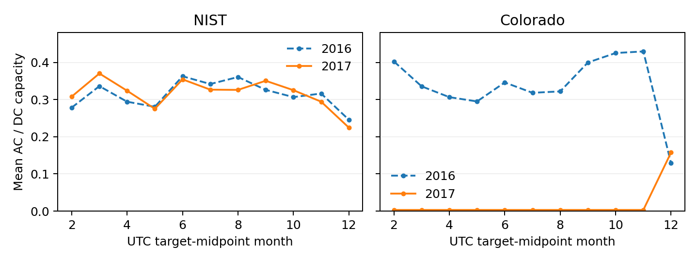

# Staff research and IEEE submission review

## Assessment

**The paper is a carefully documented controlled replay study, but the evidence does not yet justify calling it an outstanding solar forecasting contribution.** Its strongest assets are explicit information access, a prospectively frozen comparison, retained unfavorable results, and extensive reproducibility artifacts. Its principal weaknesses are limited novelty against close prior work, the absence of a stable recovery-specific benefit, and a newly identified near-idle regime in the Colorado evaluation data. That last finding materially weakens the interpretation of two geographic sites as evidence from two normally producing PV systems.

The appropriate submission argument is an empirical information-access study with a bounded negative result. An accuracy-improvement paper is not supported. A compelling regular paper would benefit most from independently verified producing-site evidence and a clearer demonstration that receipt-aware evaluation changes a meaningful research conclusion. More neural architectures or a longer bibliography alone would not resolve those weaknesses.

This is an author-side assessment, not an official IEEE review or certification. The assessment covers the working manuscript, frozen protocol, saved result tables, targeted implementation paths, source-power diagnostics, bibliography and publicly posted CCWC requirements. The literature cutoff and venue recheck are September 13, 2026. Bibliographic and algorithm checks do not independently establish published theorems or reproduce external experiments. No exhaustive-literature or acceptance guarantee is implied.

## Material new finding: Colorado's recorded-power regime

The archived primary Colorado evaluation contains **3,957 unique scored daylight targets, of which 3,876 (97.95%) are below 0.01 kW**, or 1% of its documented 1 kW DC capacity. None of these targets is exactly zero. The median is approximately 0.003116 kW. February–November monthly daylight AC means stay near 0.0031 kW while mean observed irradiance remains substantial. The previously reported exact-zero-plus-bright-irradiance sensitivity consequently does not detect this pattern.[^local1]

The diagnostic uses original clean-run eligibility and deduplicates target timestamps across horizons. It separately summarizes source hours by target midpoint over February–December; those source summaries are not additional independent forecast observations. The 1% threshold was chosen after results were exposed and is descriptive. It changes no eligibility rule, fitted model, forecast, interval, primary comparison or confidence interval.

| Source-period diagnostic | NIST 2017 | Colorado 2017 |
|---|---:|---:|
| Unique scored daylight targets | 3,978 | 3,957 |
| Targets below 1% of DC capacity | 340 | 3,876 |
| Exactly zero scored targets | 86 | 0 |
| Median recorded power, kW | 72.233750 | 0.003116 |
| Source daylight hours with valid PV and POA above 200 W/m² | 2,417 | 2,471 |
| Those bright hours also below 1% of capacity | 16 | 2,417 |

Source: [diagnostic workbook](diagnostic_artifacts_final/Staff_Review_Diagnostics.xlsx), `unique_scored_target_audit.csv` and `source_power_summary.csv`. Source-hour and scored-target populations are explicitly separate.[^local1]

The figure divides primary-variant monthly mean recorded daylight AC by each site's DC capacity. It compares the same calendar-month range in 2016 and 2017; it is a source-distribution diagnostic, not a new model-performance comparison. Supporting data and transformations are supplied in the workbook and `diagnostic_artifacts_final/build_provenance.json`.

The tighter quality bounds and one-minute alignment variant both retain 3,876 near-idle Colorado source hours. A direct raw-minute spot check also confirms that the low signal exists before hourly normalization; its input hash, native hour, channel means and normalized value are recorded in `raw_hour_check.json`. This bounds a conversion-error hypothesis for that sampled hour. It does not prove a year-long instrument interpretation.

Possible explanations include plant operating state, metering behavior or a change in channel meaning. The data inspected here do not distinguish them. It would be wrong to label these readings as communications outages, to infer healthy available production from irradiance, or to replace the AC target with an alternative channel simply because the resulting performance is more favorable. The frozen target is recorded AC and must remain so in the existing study.

The same result tables reveal why a calibration-only success story is misleading. Colorado's raw and recovery-calibrated forecasts have the same normalized median absolute error, approximately 0.12562; previous-day forecasting has approximately 0.01107. Calibration repairs intervals around an unchanged median. It cannot repair the base median's large mismatch to a predominantly near-idle recorded regime. Coverage improves substantially while the simple baseline remains better under WIS.[^local2]

**Required interpretation adjustment:** Colorado is evidence about this recorded-power regime under simulated delivery faults. It is not sufficient corroboration of recovery behavior across two verified normally producing systems. NIST remains informative, but a single apparently producing site's result cannot support geographic generalization. The manuscript now makes this limitation visible in the abstract, results and limitations rather than leaving it in an artifact appendix.

## Contribution and prior-work boundary

The receipt timestamp is essential to this experiment: a measurement in the final archive was not necessarily accessible at forecast issue time. The replay distinguishes resumed live packets, delayed historical packets and delayed outcome labels, and uses a matched availability control to isolate the effect of adding recovery groups. That is a defensible technical object. The question for a reviewer is whether its specification and empirical evidence provide sufficient new insight beyond existing work on missing telemetry, sequential calibration and backfill-aware forecasting.

The closest newly identified PV paper is Dhingra, Gruosso and Storti Gajani, published August 4, 2026. Its experiments use PVDAQ, probabilistic neural forecasts and random/block missingness; its methods reconstruct gaps before modeling. The article describes DC targets and irradiance-only inputs. Our causal receipt interface, unchanged AC target and explicit delayed-label updates therefore need a direct comparison, not a broad claim to introduce missing-telemetry robustness. The methods sections were inspected; matching data family does not establish identical channels or partitions.[^dhingra]

Back2Future is a second important boundary: published backfill-aware forecasting already studies evolving data vintages. Its motivating data revise values after initial release; our replay delays unchanged measurements. This distinction strengthens the terminology and prevents an unjustified first-ever backfill claim.[^backfill]

The present paper has a matched algorithmic ablation, not a causal estimate of physical outage effects. Removing recovery coordinates also changes group support and the local/global mixture. The contrast therefore measures the implemented grouping rule, including its sparsity consequences; it does not establish whether all uses of recovery information are useless. Likewise, failure to detect improvement is not proof of equivalence or a universal impossibility result.

### Literature adjustments

| Work and verified status | Relevance and action |
|---|---|
| Dhingra et al., *Neural Computing and Applications*, August 2026 | Closest missing-telemetry PVDAQ benchmark; added direct scope comparison. Its scores are not transplanted into our result table.[^dhingra] |
| Suresh et al., *Scientific Reports*, April 2026 | PV-specific daily-reset ACI; added citation and distinction from our daylight-only, receipt-updated control.[^suresh] |
| Ilić et al., *Energies*, July 2026 | OOD detection plus EnbPI-based calibration and retraining; added as a distribution-shift comparator family. Publisher search-index methods were accessible; direct HTML/PDF retrieval failed, so no independent proof audit is claimed.[^ilic] |
| Renkema et al., *Solar Energy Advances*, 2024 | PV neighbor/Mondrian calibration predates this work; added to avoid implying state-conditioned solar calibration is new.[^renkema] |
| Xu and Xie, ICML 2023 | SPCI predicts conditional residual quantiles using temporal information; added as an important unimplemented sequential comparator.[^spci] |
| Jensen et al., arXiv version 2, November 2022 | EnCQR's out-of-sample ensemble construction and sequential residual replacement differ from the fixed base model here; added. The inspected version is identified explicitly.[^encqr] |
| Kamarthi et al., arXiv version 8, April 2022, ICLR-associated work | Backfill of revised values versus delayed unchanged measurements; added terminology boundary.[^backfill] |
| Gneiting, Lerch and Schulz, *Solar Energy*, 2023 | Solar-specific benchmark and verification foundation; added to support proper scores, calibration and meaningful simple controls.[^gneiting] |
| Manokhin, arXiv version 1, June 2026 | Recent evidence advocating simple conformal forecasting floors. Retained in this review; the existing dressed persistence controls are not labeled an exact reproduction. No need to add a citation merely for recency.[^floor] |
| Feldman, Bates and Romano, ICLR 2026 | Missing/corrupted-label uncertainty and robust reweighting are adjacent to label selection. Retained as a future-method lead; our method does not impute missing targets or inherit these guarantees.[^corrupted] |
| Sabashvili, arXiv version 2, January 2026 | Monthly-sales conformal benchmark; background only. Its ranking does not establish the right PV telemetry method.[^benchmark] |
| El Halabi and Brandt, arXiv version 1, September 7, 2026 | Already cited. Its fixed-delay construction does not certify irregular returns, permanent loss or clipped current-level updates here.[^delay] |

The revised manuscript adds eight references, bringing its bibliography to twenty. Existing coverage of PV multiple imputation, CP-MDA, mask-conditional distributional imputation, CQR, ACI, multi-step feedback and context-aware renewable calibration remains. The closest-method distinction is based on inspected methods, not an assumption that a recent paper must be superior. Searches also covered solar benchmarking, imputation, missing labels, sequential feedback and backfill beyond PV; irrelevant architecture-only papers were not added to inflate the bibliography.

## Scientific review findings

### Experimental validity and data access

The frozen implementation separates measurement end and receipt time; late history cannot overwrite newer live data, unavailable labels cannot update calibration, and duplicate deliveries cannot generate duplicate updates. The primary forecast horizon and unfinished-interval policy are explicit. The targeted code review found these interfaces consistent with the manuscript; the previously completed automated verification and preserved tests support the larger correctness claim. This review additionally checked all 83 original protocol file hashes before reading diagnostic data.[^local3]

These strengths do not validate operational realism. Faults are injected independently of weather and do not reproduce observed communications incidents. Weather-dependent failures, congestion, clock drift, conflicting revisions, authentication failures and genuine plant shutdowns are outside the experiment. Adding every mechanism would dilute the paper. The highest-value next evidence is an actual receipt log or independently justified delivery distribution, with the target's physical meaning documented.

Native missing source hours also remain absent. Observed-target scoring is appropriate for the declared recorded-AC estimand, but cannot establish performance on outcomes that were never measured. Completeness percentages and valid hashes are not metrological validation. The Colorado diagnosis demonstrates that plausibility screening must examine positive low-output regimes as well as exact zeros.

### Controls and fairness

Fifteen outputs are useful coverage of implementation choices, but not fifteen independent state-of-the-art systems. Several share the same fitted quantiles and differ only in calibration. The physical-context and imputation controls are adaptations. There is no faithful SPCI, EnCQR, full CACP or Wen neural implementation. The revised related-work section says so directly.

For a narrow claim about adding recovery groups, the matched availability control is the most relevant reference. For a claim that the forecasting system is competitive, the strong previous-day and geometric-persistence results must remain prominent, and at least one faithful external sequential comparator would materially improve credibility. Comparator integration needs the same issue-time information, target mask, horizon definitions, tuning budget and daylight policy. Quietly granting an external comparator complete outcome history would invalidate the comparison.

A future modern neural model is justified only if it tests a specific hypothesis about the weak base forecast or provides a faithful closest-paper comparison. Switching model family after seeing the 2017 results and retaining the label “reserved evaluation” would be incorrect. Any such work needs a separately dated exploratory extension and a new untouched evaluation partition for confirmatory claims.

### Statistical interpretation

The primary analysis retains all four site/window contrasts, resamples calendar blocks jointly across common-weather scenarios, and reports 14- and 28-day block sensitivities. These are appropriate protections against treating replay rows as independent. The 14.1 million saved records are an engineering verification count, not inferential sample size. Early recovery cells contain only 124–150 eligible pairs and 29–35 distinct events; the low-support flags belong in the main narrative.[^local2]

Three primary intervals include zero under the seven-day specification. The small adverse Colorado late-window interval crosses zero with 28-day blocks. Neither site meets the separate 5% engineering-improvement gate against the fixed physical-context comparator. This supports a bounded absence-of-demonstrated-benefit statement. It does not justify equivalence, a best-method claim or selective emphasis on the favorable asynchronous NIST sensitivities.

A larger local support diagnostic could clarify *why* grouping fails: match frequency, effective local sample size, mixing strength and score-age distribution are useful candidate summaries. Those investigations would be post-hoc on the current results. The current global-fallback percentages alone do not demonstrate that support reduction caused the null result. A future group-granularity or shrinkage experiment should declare a fixed grid before evaluating new data.

The reported coverage band is a diagnostic, not a distribution-free guarantee. Weighted empirical score quantiles, finite-rank capping, clipped adaptive levels, overlapping time-series outcomes and selective label absence require assumptions beyond classical split conformal inference. The manuscript's restraint here is a strength. A proof cannot be obtained by adding a conformal citation to the existing implementation.

### Evaluation and presentation

WIS, median error, coverage and width should be interpreted together. Colorado demonstrates why coverage repair alone can conceal a poor median, while overcoverage alone does not negate a lower proper score. The broad method table retains both facts. Independent interval coverage at each horizon is not joint four-hour trajectory coverage; no dispatch-risk guarantee follows from it.

The frozen plots have explicit source tables, matching comparison rows and stated scale differences. The recovery lines almost overlap; that visual accurately reflects the small differences. The new source-regime figure is supplied in this review with a workbook rather than replacing an unfavorable result plot. No generated visual simulates a measured outcome.

The seven-page manuscript is dense but readable. Four tables and three figures are retained, all citations resolve, and the IEEEtran layout uses embedded fonts. Large tables float later than their first discussion; this is a presentation compromise rather than a statistical defect. A later rewrite could trade an ablation table for a compact main-text source-regime panel, but only with continued access to every original result.

## IEEE and CCWC checks

The public CCWC instructions were rechecked. The relevant current deadline is November 6, 2026. Review submissions use anonymous author labels and omit affiliations, IEEE grades, funding and acknowledgments; submission is through EDAS. The public page leaves the acceptance date blank and final PDF eXpress/copyright details as placeholders. These unresolved fields should not be invented.[^ccwc]

Regular papers allow seven pages plus up to three paid additional pages; work-in-progress papers allow six plus two paid pages. The working draft remains seven pages. Computing/AI or Energy Management and Green Computing are plausible topic choices based on the posted scope; final EDAS options have not been authenticated.[^cfp]

| Check | Result and practical limit |
|---|---|
| Template and page count | IEEEtran conference format; seven pages; no reduced-margin workaround. |
| Fonts and compilation | Twenty embedded fonts; no overfull or undefined-reference issue lines in the build. |
| PDF anonymity | Blank author metadata, “Author 1,” and no hits for the configured local identity/path patterns. This is a targeted scan, not universal identity certification. |
| References | Twenty entries; eight new sources checked against publisher/proceedings or author-hosted versions, with access limits recorded. No performance claim against an unimplemented method. |
| Numerical evidence | Original 159-claim ledger preserved; new post-hoc source facts have a separate ledger and hashed CSVs. |
| Scientific contribution | Needs stronger producing-site evidence and a clear empirical insight; formatting compliance cannot resolve this. |
| Originality and concurrent submission | Human author confirmation remains required; no commercial similarity report was run. |
| AI use | Disclosure now identifies affected sections and plotting-code assistance; placement remains unresolved for anonymous review. |
| Independent reproduction | Automated reproduction exists; no second human contributor has signed off. This is a project gate, not a newly invented universal IEEE requirement. |
| Author/rights information | Real authors, order, consent and original-code license remain unset. |
| PDF eXpress | Not run; local font/layout checks are not IEEE validation. |
| External actions | No submission, organizer message, publication, registration or payment. |

IEEE's linked AI guidance requires identification of generated content, the system and affected sections, with disclosure in acknowledgments. CCWC simultaneously asks anonymous manuscripts to omit acknowledgments. The present draft uses a non-identifying disclosure in limitations; that is a transparent interim editorial choice, not confirmation that the organizer accepts its placement. The camera-ready version will need the accepted disclosure location. Only the organizers can settle the venue-specific ambiguity.[^ai]

The posted Turnitin AI-score wording is not a measured score for this manuscript. No tool here can certify that threshold, and prose should not be rewritten to evade detection. Likewise, this author-side assistance must not be presented as an official confidential IEEE peer review.[^ccwc]

## Changes completed in this revision

The working manuscript now leads related work with the closest August 2026 PVDAQ study, adds the missing PV/sequential/backfill foundations, narrows its contribution language, discloses the near-idle Colorado regime, and identifies AI-assisted sections more precisely. The abstract reports the new diagnostic explicitly. The earlier PDF, text, bibliography and audits are preserved under `before/`; the v1 ZIPs remain historical snapshots.

The source diagnostic is executable, verifies the original protocol hashes, asserts correspondence between scored targets and the normalized source, and writes separate CSVs with provenance. It includes a raw-hour conversion check, a monthly regime plot and a supporting spreadsheet. These are post-exposure descriptive artifacts. No primary table, forecast or experimental setting was rewritten.

This review changes the readiness assessment. Passing the earlier mechanical and artifact checks should no longer be read as a complete scientific readiness recommendation. The package is suitable for critical coauthor review. It is not yet a strong basis for a broad producing-site or forecasting-superiority submission.

## Prioritized route to a stronger paper

1. **Resolve the Colorado channel interpretation.** Examine public instrument metadata and neighboring channels without changing the frozen target. If confirmation requires operator knowledge, prepare a concise technical question and obtain authorization before contacting anyone. A successful resolution identifies what the recorded 3 W regime represents; it does not require a favorable model result.
2. **Add independently qualified producing-site evidence.** Preserve the original two-site results. Select additional sites/years using instrument provenance and source plausibility before inspecting forecast scores. At least one additional producing site would address the immediate corroboration gap; multiple distinct sites and years would support a stronger generalization argument. Three is not a magical statistical threshold.
3. **Demonstrate the value of correct receipt handling.** A separately specified comparison of correct receipts versus an explicitly nonoperational archive-time oracle could quantify evaluation distortion. The existing privileged-label sensitivity isolates only part of that question. Select the metric and direction-neutral reporting rule before running the extension; keep every outcome.
4. **Implement one faithful external calibration baseline.** Prefer a method chosen for the question, such as SPCI or EnCQR, with a written receipt/delay adaptation contract. Tune on development data, use the same available information and document deviations. Do not call a loosely related weighted-quantile rule a reproduction.
5. **Obtain an independent reproduction and substantive coauthor review.** Ask a contributor to regenerate the principal tables from the retained environment and inspect receipt invariants, not merely confirm the PDF opens. Record discrepancies and their resolution.
6. **Reassess the submission claim before packaging.** A regular paper remains plausible if the new evidence makes the information-access contribution compelling. If the evidence remains preliminary, consider a focused work-in-progress submission under its six-page target. Neither route guarantees acceptance. Resolve authorship, disclosure placement and release permissions before any authorized submission.

The first two actions have the highest scientific value. Adding transformer experiments before understanding the target regime risks optimizing a model against an unexplained signal. The current honest negative result should be retained even if a future extension succeeds.

## Sources

[^local1]: Local post-exposure diagnostic: `research/staff_review_v2/diagnostics/{manifest.json,monthly_source_power.csv,source_power_summary.csv,unique_scored_target_audit.csv,raw_hour_check.json}`; generated from hashed PVDAQ inputs and saved original forecasts. The input dataset is [PVDAQ Public Datasets, DOI 10.25984/1846021](https://data.openei.org/submissions/4568). No operational receipt logs or physical fault labels were supplied.
[^local2]: Local frozen analysis: `runs/final_2017_v4/analysis/{Summary.csv,Contrasts.csv,Support.csv,Diagnostics.csv}` and `research/FINAL_FINDINGS.md`. Exact selected summary rows are copied into this review's diagnostic directory; the original analysis remains unchanged.
[^local3]: Local protocol and implementation: `research/FINAL_PROTOCOL_LOCK.json`, `research/FINAL_EVALUATION_PROTOCOL.md`, `solar_recovery/calibration_v2.py`, `solar_recovery/calibration_v3.py`, replay implementations, and `runs/final_2017_v4/verification.json`. The original PRD is `Solar_Forecasting_Research_PRD.docx`.
[^dhingra]: S. Dhingra, G. Gruosso and G. Storti Gajani. [Short-term PV power forecasting under real-world data constraints: a benchmark study of neural networks with uncertainty quantification](https://link.springer.com/article/10.1007/s00521-026-12335-1). *Neural Computing and Applications* 38, 626, August 4, 2026. Sections 3.1–3.3 and 3.9 inspected.
[^suresh]: V. Suresh, B. Sri Revathi and J. M. Guerrero. [A non-parametric adaptive conformal inference based probabilistic hour-ahead solar PV power forecasting method](https://www.nature.com/articles/s41598-026-40911-x). *Scientific Reports* 16, 11730, April 6, 2026. Modified-ACI equations and daily-reset description inspected.
[^ilic]: U. Ilić et al. [Out-of-Distribution-Aware Time Series Conformal Prediction with Adaptive Retraining for Solar Power Forecasting](https://www.mdpi.com/1996-1073/19/14/3446). *Energies* 19(14), 3446, July 22, 2026. Publisher-indexed introduction, methods/results excerpts and citation metadata inspected; direct fetch unavailable.
[^renkema]: Y. Renkema, L. Visser and T. AlSkaif. [Enhancing the reliability of probabilistic PV power forecasts using conformal prediction](https://doi.org/10.1016/j.seja.2024.100059). *Solar Energy Advances* 4, 100059, 2024. Publisher metadata and institutional full text consulted.
[^spci]: C. Xu and Y. Xie. [Sequential Predictive Conformal Inference for Time Series](https://proceedings.mlr.press/v202/xu23r.html). ICML, PMLR 202:38707–38727, 2023. Proceedings metadata and paper introduction/method description consulted.
[^encqr]: V. Jensen, F. M. Bianchi and S. Normann Anfinsen. [Ensemble Conformalized Quantile Regression for Probabilistic Time Series Forecasting](https://arxiv.org/html/2202.08756v2). Version 2, November 6, 2022. Algorithm 2 and data-subset construction inspected; the full text confirms “Normann.”
[^backfill]: H. Kamarthi, A. Rodríguez and B. A. Prakash. [Back2Future: Leveraging Backfill Dynamics for Improving Real-time Predictions in Future](https://arxiv.org/abs/2106.04420v8). Version 8, April 26, 2022; arXiv metadata identifies ICLR 2022. Data-revision framing and full-text description consulted.
[^gneiting]: T. Gneiting, S. Lerch and B. Schulz. [Probabilistic solar forecasting: Benchmarks, post-processing, verification](https://doi.org/10.1016/j.solener.2022.12.054). *Solar Energy* 252:72–80, 2023. Publisher-indexed reference-forecast discussion and institutional paper consulted.
[^floor]: V. Manokhin. [Report the Floor: A Training-Free Conformal Interval Is a Mandatory Baseline for Probabilistic Time-Series Forecasting](https://arxiv.org/abs/2606.09473v1). Preprint, June 8, 2026. Abstract-level screening; no external numerical result adopted.
[^corrupted]: S. Feldman, S. Bates and Y. Romano. [Conformal Prediction with Corrupted Labels: Uncertain Imputation and Robust Re-weighting](https://proceedings.iclr.cc/paper_files/paper/2026/hash/3446f5683cee5e6a0484a3bd0706e8f0-Abstract-Conference.html). ICLR 2026. Proceedings abstract screened; proofs not audited.
[^benchmark]: A. Sabashvili. [Conformal Prediction Algorithms for Time Series Forecasting: Methods and Benchmarking](https://arxiv.org/abs/2601.18509v2). Preprint, revised January 30, 2026. Abstract-level screening.
[^delay]: L. El Halabi and A. Brandt. [Adaptive Conformal Inference Under Delayed Feedback: Coverage Guarantees and a Delay-to-Memory Diagnostic](https://arxiv.org/html/2609.07251v1). Preprint, September 7, 2026. Existing detailed crosswalk retained; no theorem transferred to this implementation.
[^ccwc]: IEEE CCWC. [Submissions](https://ieee-ccwc.org/submissions/). Rechecked September 13, 2026; anonymity, deadline, acceptance wording and final-paper placeholders.
[^cfp]: IEEE CCWC. [Call for papers](https://ieee-ccwc.org/call-for-papers/). Rechecked September 13, 2026; current 2027 categories and scope. The stale 2023 block is not the operative deadline.
[^ai]: IEEE Robotics and Automation Society. [Guidelines for Generative AI Usage](https://www.ieee-ras.org/publications/guidelines-for-generative-ai-usage/). Rechecked September 13, 2026; quotes IEEE PSPB 8.2.1.B.10 on disclosure. Society-specific guidance is distinguished from CCWC's local instructions.
