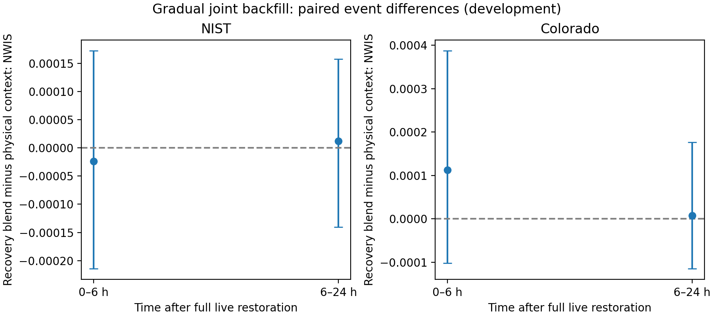

# Matched annual calibration findings

This experiment uses the same validation-selected quantile forecasts for all calibration methods, with fixed common window/recency settings. Physical context excludes explicit recovery age. The candidate adds a blend toward matching coarse recovery states; those states also include age/missing-fraction bins. These are empirical controls, not a reproduction of the full published CACP or mask-conditional algorithms.

## Early recovery

The table averages horizon cells within the first six hours after full live restoration, for the gradual joint-backfill scenario, on July–December 2016 development data. Coverage is a fraction for nominal 90% intervals.

| site | method | nwis | coverage90 | nwidth90 |
| --- | --- | --- | --- | --- |
| colorado | physical | 0.053735 | 0.879909 | 0.413066 |
| colorado | physical_recovery | 0.053857 | 0.886489 | 0.412044 |
| colorado | raw | 0.054683 | 0.824319 | 0.394994 |
| colorado | recency | 0.053967 | 0.886364 | 0.412178 |
| nist | physical | 0.045111 | 0.881219 | 0.334109 |
| nist | physical_recovery | 0.045119 | 0.868354 | 0.333635 |
| nist | raw | 0.046582 | 0.788610 | 0.313640 |
| nist | recency | 0.045226 | 0.887671 | 0.335290 |

## Incremental recovery contribution

The paired comparison subtracts physical-context NWIS from the recovery blend on the same forecasts, then averages within events. Negative values favor the recovery blend. Percentile intervals resample event means 10,000 times within site/scenario/phase (seed 20260912). They are exploratory, unadjusted for multiple comparisons and conditional on these sites and this schedule; they are not a population-wide guarantee.

| site | phase | events | mean_nwis_difference | ci_lower | ci_upper |
| --- | --- | --- | --- | --- | --- |
| colorado | recovery_0_6 | 22 | 0.000112 | -0.000101 | 0.000387 |
| colorado | recovery_6_24 | 26 | 0.000008 | -0.000114 | 0.000176 |
| nist | recovery_0_6 | 23 | -0.000024 | -0.000214 | 0.000172 |
| nist | recovery_6_24 | 26 | 0.000012 | -0.000140 | 0.000158 |

The small, mixed differences do not establish a recovery-specific improvement. Generic empirical calibration improves several raw-interval diagnostics, but performance and coverage remain phase/site dependent. Do not replace this conclusion with a comparison only against raw forecasts. Availability-only grouping, calibration-parameter and delivery sensitivities remain necessary before the final protocol is frozen.

Full phase results, additional method contrasts and score-pool/repair diagnostics are in the CSV files and `Calibration_Development_Evidence.xlsx`. Diagnostic means use the same eligible daylight, valid-target development forecasts as performance summaries. The independent verifier checks immutable base/median agreement, target/score consistency, sampled interval repairs and expected receipt-gated update counts. The unit suite also tests prefix invariance under changed future labels.

This is development evidence. Reserved 2017 forecast performance has not been examined. See [the closest-method crosswalk](../../research/CLOSEST_METHOD_CROSSWALK.md) and [the annual protocol](../../research/ANNUAL_DEVELOPMENT_PROTOCOL.md) for implementation differences and limitations.
