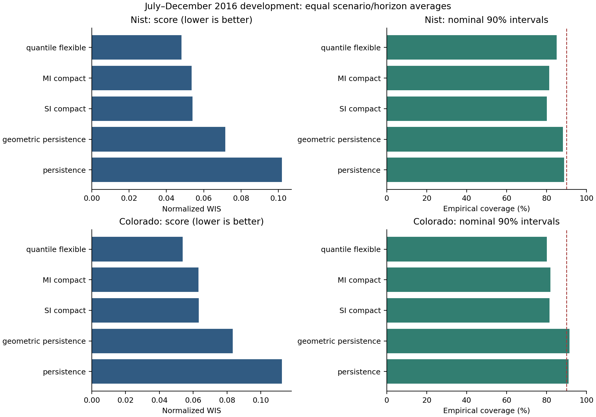
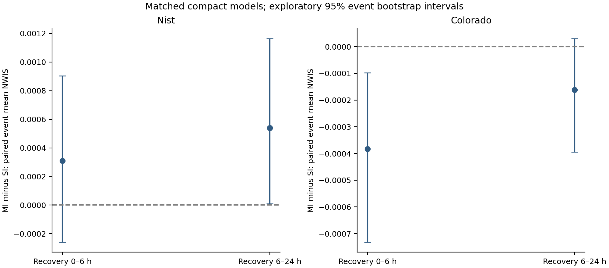

# Annual AC development findings

The annual comparison is development evidence, not a final test or an established recovery-method contribution. It uses two geographic sites, 2015 training, February–June 2016 profile selection, and July–December 2016 diagnostics. A prior all-hour fit produced degenerate NIST quantile models and is excluded from claims of algorithmic superiority. This corrected run trains all baseline families on daylight targets and makes stochastic imputations invariant to future rows and batch order.

## Main comparison

Entries below average equally across eight scenarios and four horizons. NWIS and width are normalized by documented DC nameplate capacity. Coverage is a fraction; the nominal level is 0.90. Lower WIS alone does not establish calibrated uncertainty.

| site | method | nwis | nmae | coverage90 | nwidth90 |
| --- | --- | --- | --- | --- | --- |
| nist | geometric_persistence | 0.0716 | 0.1240 | 0.8825 | 0.4609 |
| nist | multiple_imputation_compact | 0.0535 | 0.0858 | 0.8140 | 0.2698 |
| nist | persistence | 0.1019 | 0.2012 | 0.8887 | 0.5800 |
| nist | quantile_flexible | 0.0481 | 0.0827 | 0.8515 | 0.3634 |
| nist | single_imputation_compact | 0.0541 | 0.0851 | 0.8011 | 0.2594 |
| colorado | geometric_persistence | 0.0834 | 0.1444 | 0.9153 | 0.5958 |
| colorado | multiple_imputation_compact | 0.0631 | 0.0975 | 0.8190 | 0.3082 |
| colorado | persistence | 0.1125 | 0.2236 | 0.9112 | 0.6910 |
| colorado | quantile_flexible | 0.0538 | 0.0965 | 0.8013 | 0.3703 |
| colorado | single_imputation_compact | 0.0633 | 0.0972 | 0.8148 | 0.3043 |

## Matched imputation comparison

These differences compare ten stochastic test-input completions with deterministic mean completion under identical compact fitted point models. Negative differences favor MI. Each event averages its eligible forecast differences within scenario, then averages scenarios. The percentile bootstrap resamples event IDs within a site; intervals are exploratory, unadjusted for multiple comparisons and conditional on this schedule. They cannot establish generalization across geographic populations or unobserved outage processes.

| site | phase | events | mean_nwis_difference | ci_lower | ci_upper |
| --- | --- | --- | --- | --- | --- |
| colorado | recovery_0_6 | 26 | -0.0004 | -0.0007 | -0.0001 |
| colorado | recovery_6_24 | 26 | -0.0002 | -0.0004 | 0.0000 |
| nist | recovery_0_6 | 25 | 0.0003 | -0.0003 | 0.0009 |
| nist | recovery_6_24 | 26 | 0.0005 | 0.0000 | 0.0012 |

Backfill contrasts for each selected model, full phase tables and per-event differences are in the CSV files and `Annual_Development_Evidence.xlsx`. The compact and flexible SI/MI pairs are retained even when another profile is selected. All methods share observed evaluation targets; naturally absent targets remain unscored.

## What this establishes and what remains

The experiment establishes a reproducible two-site comparison with separate live resumption, immediate backlog, gradual backlog and permanent-loss schedules. It does not yet establish a recovery-aware calibration improvement. The published imputation comparator is adapted to joint-channel missingness, observed-only training labels, extra causal features and gradient boosting; it is not a faithful reproduction of the original model/tuning configuration. Training-residual normal intervals have no coverage guarantee.

Complete matched physical-context, mask, recency and delayed-adaptive calibration; repeated outage seeds and durations; timestamp/quality sensitivity; and the frozen 2017 evaluation before finalizing a regular-paper claim. The original PRD and all prior run artifacts remain preserved. See [the full development protocol](../../research/ANNUAL_DEVELOPMENT_PROTOCOL.md) for data contracts, timing, method choices and primary sources.
