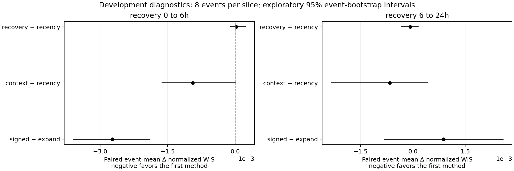

# Event-level calibration diagnostics

These paired comparisons use the same forecast origins, targets, horizons and scheduled events. Each event contributes one mean difference, so the uncertainty calculation does not treat overlapping forecasts as independent samples. Negative values favor the first named method.

| phase | comparison | events | forecast_rows | pooled_delta_nwis | equal_event_delta_nwis | bootstrap_low | bootstrap_high |
| --- | --- | --- | --- | --- | --- | --- | --- |
| recovery_0_to_6h | signed_day − expand_day | 8 | 135 | -0.0027 | -0.0027 | -0.0036 | -0.0019 |
| recovery_0_to_6h | context_day − recency_day | 8 | 135 | -0.0008 | -0.0009 | -0.0016 | 0.0000 |
| recovery_0_to_6h | recovery_day − recency_day | 8 | 135 | 0.0001 | 0.0000 | -0.0001 | 0.0002 |
| recovery_6_to_24h | signed_day − expand_day | 8 | 201 | 0.0011 | 0.0009 | -0.0008 | 0.0026 |
| recovery_6_to_24h | context_day − recency_day | 8 | 201 | -0.0006 | -0.0007 | -0.0024 | 0.0004 |
| recovery_6_to_24h | recovery_day − recency_day | 8 | 201 | -0.0001 | -0.0001 | -0.0003 | 0.0002 |

Intervals are percentile bootstrap intervals from 5,000 resamples of eight event means per slice. They are exploratory and conditional on this one site, period and fault schedule. They assume events are exchangeable/independent enough for the resampling approximation; native outages, serial dependence and missing-event selection may violate that assumption. These intervals are not final-test inference, a cross-site result, or a multiplicity-adjusted claim. A small sample can also produce deceptively narrow intervals when methods behave similarly.

`pooled_delta_nwis` weights all eligible forecast rows equally; `equal_event_delta_nwis` weights events equally and is the plotted estimate. A difference between them reflects event-size weighting, not an inconsistency. Exact event differences and figure data are included in adjacent CSV files.

The table should guide development, not establish a winner. In particular, any benefit from signed/daylight calibration must be separated from additional recovery conditioning, and early gains must be checked against later recovery performance and coverage.
