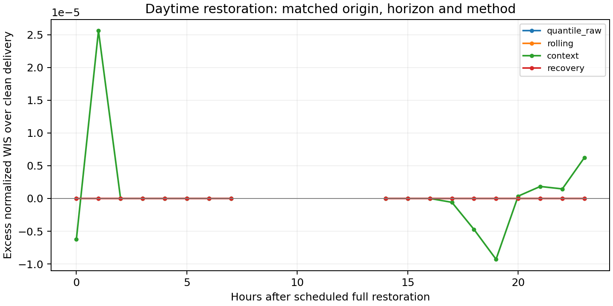

# Daytime recovery diagnostics

The recovery-conditioned calibrator makes **0 nonzero interval corrections across 336 scorable daylight recovery forecasts** in the development period. Its unchanged output is a substantive finding about this implementation and setting, not a demonstrated benefit. Base intervals are already broad, and this implementation cannot shrink them. Available calibration history is not the same as adequate state-matched support.

| phase | method | n | nonzero_corrections | median_pool | median_matching_pool | nwis |
| --- | --- | --- | --- | --- | --- | --- |
| recovery | context | 336 | 7 | 646.0000 | 20.5000 | 0.0902 |
| recovery | persistence | 336 | 336 | 646.0000 | 20.5000 | 0.1194 |
| recovery | quantile_raw | 336 | 0 | 0.0000 | 0.0000 | 0.0902 |
| recovery | recovery | 336 | 0 | 646.0000 | 20.5000 | 0.0902 |
| recovery | rolling | 336 | 0 | 646.0000 | 20.5000 | 0.0902 |

Each point subtracts clean-delivery WIS from the degraded-delivery WIS for the same origin, horizon and method. Gaps indicate no eligible daylight targets for that recovery hour. This pairing removes the direct confounding from comparing different target hours in an absolute-WIS curve; selection due to missing targets and changing sample counts remains. Lines overlap where forecasts coincide. No confidence intervals or significance claims are made.

The rolling and recovery variants have not demonstrated an advantage in this pilot. The next methodological step is to examine over-wide base intervals, daytime-matched calibration, bidirectional interval adjustment with coherent quantile nesting, and state-support shrinkage, using development data only. Better target completeness, stronger baselines and independent evaluation are still required before any paper claim.

These are post-run diagnostics. The source forecast files are unchanged; `diagnostics_manifest.json` records their hashes and the analysis script hash. Run `python3 -m research.analyze_daytime_probe` to reproduce.
