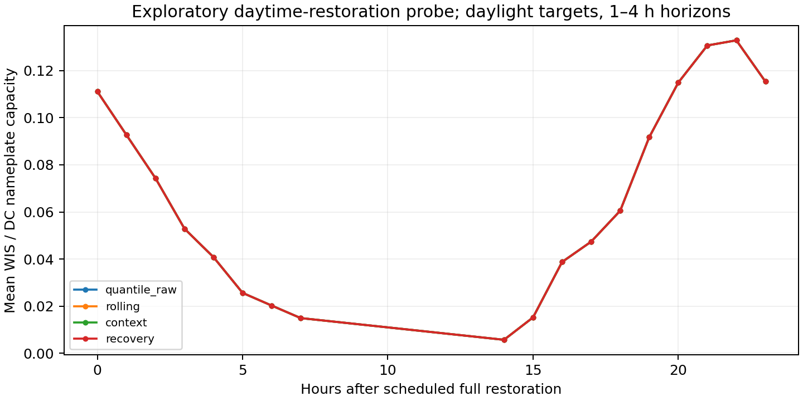

# Daytime restoration: exploratory follow-up

The original 12-hour fault schedule restored both streams at night. This probe shifts the same events twelve hours earlier: PV returns at UTC 14–18, with irradiance restored three hours earlier. 52 of 52 scheduled full restorations occur in geometric daylight. The model, source data, methods and hyperparameters are unchanged; causal calibration is replayed under the new delivery schedule.

This diagnostic was chosen after inspecting the original schedule and preliminary results. It is development evidence, not a new untouched test or a preregistered comparison. Missing native target data still limits which events can be scored. Training augmentation used the original schedule distribution, so this also changes the restoration timing relative to augmentation.

## Development results

Lower normalized WIS is better; nominal coverage is 0.90. Forecasts overlap across horizons and are not independent replicates. Recovery slices refer to time since scheduled restoration, not a guarantee of native sensor health.

| phase_detail | method | n | events | nwis | coverage90 | width90_kw |
| --- | --- | --- | --- | --- | --- | --- |
| outage | context | 104 | 9 | 0.0931 | 1.0000 | 196.5214 |
| outage | persistence | 104 | 9 | 0.1559 | 0.7692 | 128.4631 |
| outage | quantile_raw | 104 | 9 | 0.0931 | 1.0000 | 196.4933 |
| outage | recovery | 104 | 9 | 0.0931 | 1.0000 | 196.4933 |
| outage | rolling | 104 | 9 | 0.0931 | 1.0000 | 196.4933 |
| partial_restoration | context | 100 | 9 | 0.1373 | 0.9500 | 216.5990 |
| partial_restoration | persistence | 100 | 9 | 0.2828 | 0.5200 | 120.0232 |
| partial_restoration | quantile_raw | 100 | 9 | 0.1371 | 0.9500 | 215.1602 |
| partial_restoration | recovery | 100 | 9 | 0.1371 | 0.9500 | 215.1602 |
| partial_restoration | rolling | 100 | 9 | 0.1371 | 0.9500 | 215.1602 |
| recovery_0_to_6h | context | 135 | 8 | 0.0766 | 0.9926 | 153.1756 |
| recovery_0_to_6h | persistence | 135 | 8 | 0.1136 | 0.8370 | 175.0781 |
| recovery_0_to_6h | quantile_raw | 135 | 8 | 0.0766 | 0.9926 | 153.1756 |
| recovery_0_to_6h | recovery | 135 | 8 | 0.0766 | 0.9926 | 153.1756 |
| recovery_0_to_6h | rolling | 135 | 8 | 0.0766 | 0.9926 | 153.1756 |
| recovery_6_to_24h | context | 201 | 8 | 0.0993 | 0.9303 | 141.1735 |
| recovery_6_to_24h | persistence | 201 | 8 | 0.1233 | 0.8259 | 144.2693 |
| recovery_6_to_24h | quantile_raw | 201 | 8 | 0.0993 | 0.9303 | 141.1735 |
| recovery_6_to_24h | recovery | 201 | 8 | 0.0993 | 0.9303 | 141.1735 |
| recovery_6_to_24h | rolling | 201 | 8 | 0.0993 | 0.9303 | 141.1735 |

The initial calibrators only expand intervals. The all-hours calibration pool and daylight evaluation target different distributions; sparse state support and nighttime score mass remain limitations. Do not interpret a nearly overlapping curve as evidence of equivalence or general method failure. Multiple independent sites, seeds, stronger baselines and a frozen protocol remain necessary.

## Reproduction

Run `python3 -m research.run_daytime_probe --parent runs/nist_2015_pilot_v1 --output runs/nist_2015_daytime_probe_v2`. Parent models must be the trusted locally generated artifacts. `metrics.csv`, `forecasts.parquet`, `features.parquet`, the figure's CSV/PDF, and `manifest.json` provide the results and provenance.
