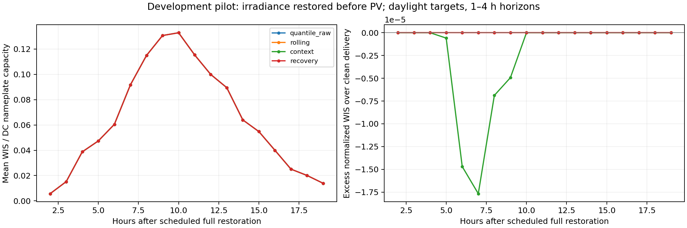
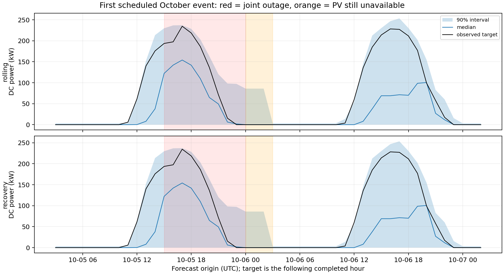

# NIST 2015 development pilot

For the preselected irradiance-first recovery slice, recovery calibration changes mean normalized WIS by +0.00% relative to rolling calibration (lower is better). This is descriptive evidence from one site and one schedule seed, not a significance or novelty claim.

## Scope and interpretation

Real measured DC power and measured plane-of-array irradiance from PVDAQ system 4902, 270.7 kW DC nameplate. The simulated faults affect information delivery, never the physical target. Original operational receipt times are unavailable: immediate receipt at a completed hour is an explicit normal-operation assumption. Native gaps and excluded measurements remain unavailable in every scenario.

The fixed quantile model is trained through June; July–mid-August warms calibration, mid-August–September is validation, and October–December is development evaluation. Forecasts whose targets cross a split end are excluded from that split's metrics. Online calibration continues causally across splits. All these dates are now development data and must not be presented as a pristine final test.

**Schedule limitation:** only 0 of 52 scheduled full restorations occur during geometric daylight. Starting 12-hour faults during the day places restoration at night, weakening the test of immediate daytime recovery. A separate exploratory daytime-restoration probe is documented in the repository; this schedule alone cannot settle that research question.

Seven delivery scenarios × four horizons × five methods are saved. Baselines are calibrated persistence, raw boosted quantiles, rolling calibration, and context-weighted calibration. Recovery calibration mixes state-matched and global empirical score distributions. All boosted methods share the same frozen model and block-augmented training. The methods are empirical; finite-sample conformal coverage is not established.

## Preselected recovery slice

Irradiance is restored three hours before PV during 12-hour events. Recovery means the first 24 hours after scheduled full restoration; observable feature state can still reflect native sensor gaps. Of 13 events with full restoration scheduled within the development period, 8 have scorable daylight recovery forecasts. Rows pool eligible daylight forecasts over 1–4-hour horizons; `n` counts overlapping forecasts, and `events` counts distinct scheduled events.

| method | n | events | nwis | coverage90 | width90_kw |
| --- | --- | --- | --- | --- | --- |
| context | 332 | 8 | 0.0886 | 0.9578 | 144.7318 |
| persistence | 332 | 8 | 0.1114 | 0.8886 | 164.8790 |
| quantile_raw | 332 | 8 | 0.0886 | 0.9578 | 144.7318 |
| recovery | 332 | 8 | 0.0886 | 0.9578 | 144.7318 |
| rolling | 332 | 8 | 0.0886 | 0.9578 | 144.7318 |

Nominal coverage is 0.90. Assess coverage and width together with WIS; narrower intervals alone are not a success. This first calibrator only expands base intervals and cannot sharpen an already over-wide model. Calibration pools include all available hours, while primary metrics use daylight; that mismatch is an explicit limitation to investigate. Primary reporting uses solar geometry at the target-hour midpoint, independent of measured future weather. Nighttime forecasts and validity flags remain in the Parquet files for audits.

The paired excess-WIS curve compares each degraded forecast with the same method, origin and horizon under clean delivery. The clean method has its own causally updated calibration history. Hourly points can contain different target subsets; counts are in `recovery_curve.csv`. No confidence bands or claims of recovery time are warranted from this plot alone.

The example is the first scheduled event in October, selected by date. Missing observations appear as gaps.

## Artifacts and reproduction

- `metrics.csv`: split/scenario/phase/method/horizon metrics and counts.
- `development_summary.csv`: pooled development metrics for every available scenario/phase/method.
- `forecasts_*.parquet`: immutable issued quantiles, original base quantiles, delivered-state fields, calibration support and evaluator annotations.
- `features_*.parquet`: information visible at each forecast origin.
- `event_schedules.json`: reproducible delivery interventions.
- `manifest.json`, `config.json`, `contract.json`: code/config/data hashes, package versions, training counts and assumptions.
- `models.pkl`: locally generated trusted model artifact; never load untrusted pickle files.
- CSV files alongside PNG/PDF figures contain their source data.

From the repository root, run `python3 -m solar_recovery.pilot --config configs/pilot_nist_2015.json --output runs/nist_2015_pilot_v2` to reproduce into a fresh directory. Run directories are immutable.

## Required before a paper claim

Resolve catalog quality flags and sensor-quality exclusions; assess daytime completeness and exclusion sensitivity. Add independently selected sites and an untouched final period; freeze the protocol before inspecting those results. Implement and fairly tune adaptive conformal, mask-conditional, and imputation comparators; add multiple fault seeds, durations, normal receipt delays, ablations and event/site-level uncertainty. Distinguish delayed backfill from permanent loss. Report negative findings and verify whether the proposed method adds value beyond context weighting.

No acceptance probability, cross-site robustness, statistical significance, operational receipt fidelity or new theoretical guarantee follows from this pilot.
